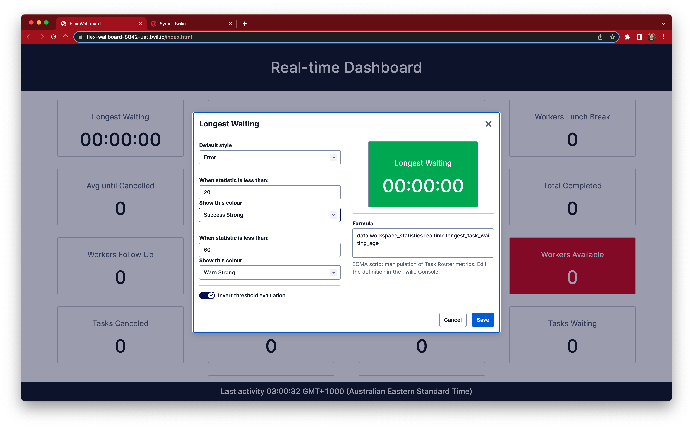
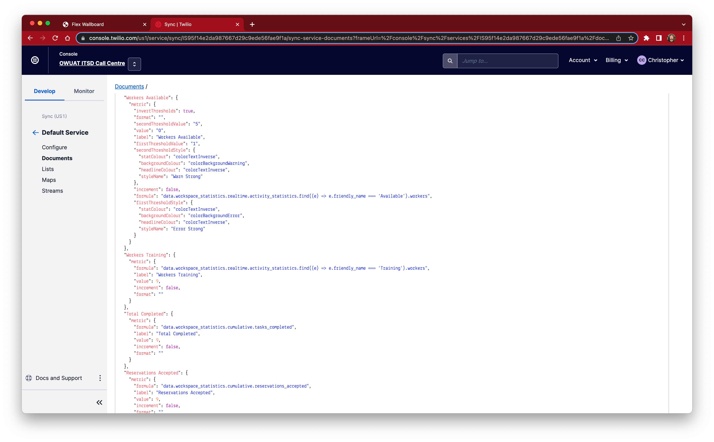

# Real-time Dashboard

Real-time dashboard to show statistics in real-time.

Stats are stored in a Twilio Sync document to which all clients are subscribed by the sync client API.

Metrics can be anything! The dashboard has a built-in ECMA script based interpreter that enables you to show any data you like by defining a formula, it can be a simple as the value or more complex as you see fit. All you need to do is define the metric and put it in the definitions sync document.





## Statistic Definition

Minimum example:

```json
{
  "Unique Stat Name": {
    "metric": {
      "value": 6,
      "label": "My awesome statistic",
      "formula": "data.key_name_to_show",
    }
  },
```

A more complex example with thresholds (colours) at different intervals

```json
{
  "Longest Waiting": {
    "metric": {
      "defaultStyle": {
        "statColour": "colorText",
        "backgroundColour": "transparent",
        "headlineColour": "colorTextDecorative10",
        "styleName": "Default"
      },
      "format": "seconds",
      "secondThresholdValue": "600",
      "value": 6,
      "label": "Longest Waiting",
      "firstThresholdValue": "10",
      "secondThresholdStyle": {
        "statColour": "colorTextInverse",
        "backgroundColour": "colorBackgroundError",
        "headlineColour": "colorTextInverse",
        "styleName": "Error Strong"
      },
      "increment": true,
      "formula": "data.workspace_statistics.realtime.longest_task_waiting_age",
      "firstThresholdStyle": {
        "statColour": "colorTextInverse",
        "backgroundColour": "colorBackgroundWarning",
        "headlineColour": "colorTextInverse",
        "styleName": "Warn Strong"
      }
    }
  }
```

## Showing Twilio Flex metrics

We use the power of Task Router to update a sync document when an event occurs, Task Router will emit a JSON document to a helper function (see: `functions/dashboardStats.js`). This function simply stores the all the metrics received into the document which in turn causes all of the dashboards to update.

Because the Task Router data has a well-known and stable structure, we can expected a certain set of values to normally exist. However if additional Break codes are configured for Flex then more or less data will be available. A set of default metrics is located in `default_stats.json`, load these into a sync document (steps below) to get bootstrapped.

# Building

This is a Twilio Serverless project, run `yarn build:<environment>` to create a new build which will put files into the `assets` folder which is ideal for Twilio Functions.
See `package.json` for script details.

## Installation (Twilio Configuration)

1. Create Twilio API key

2. Create new Sync Service (or use default)

3. Create new Sync document in above service called `dashboard-data` (see: `.env` for name)

4. Create another Sync document in the same service called `dashboard-definitions` (see: `.env` for name)

5. Import default statistic definitions from `defaultStats.json`, modify as required.

6. Update `.env` file with API Key, Auth token, Task Router workspace and Sync doc

7. Run `yarn next-build` to create new app build and put it in `assets` folder, note you can build for specific environments with:

   1. `yarn next-build:dev` which uses the `.env.development` file
   2. `yarn next-build:uat` which uses the `.env.uat` file
   3. `yarn next-build:prod` which uses the `.env.production` file

8. Set the timezone variable e.g. `DASHBOARD_TIMEZONE=Australia/Sydney` in `.env` file

9. Execute one of the following commands depending on your environment

   1. Run `twilio serverless:deploy --env=.env.development` to create new service and deploy the functions and assets
   2. Run `twilio serverless:deploy --env=.env.uat --environment=uat` to create new service and deploy the functions and assets
   3. Run `twilio serverless:deploy --env=.env.production --production` to create new service and deploy the functions and assets

10. Run `twilio api:serverless:v1:services:update --ui-editable --sid <SID>` to enable console editing

11. In Twilio console > Task Router > Workspaces > (Default workspace for Flex) > Settings, set the "Event callback URL" to https://<functions path>/dashboardStats

# Troublshooting

If you see "ERR" for a statistic it is an indicator the formula is incorrect. Check that that appropriate breaks have been configured in Flex.

If you see "ERR FMT" for a statistic it means the value of the statistic could not be convered into the appropriate format. Check the statistic definition, specifcally the "format" value.

# Credits

Original concept by Eli Kennedy, ported to NextJS and Twilio paste by C.Connolly
